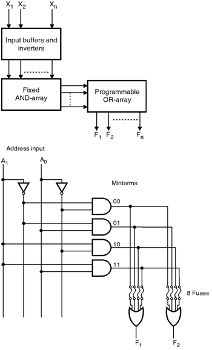
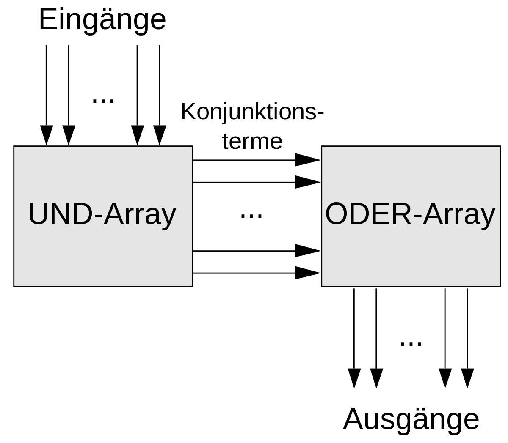

# **Aufbau ASICs (PROM, PAL/GAL)**

## **Was ist ein ASIC?**

Ein ASIC (Application-Specific Integrated Circuit, auf Deutsch: anwendungsspezifische integrierte Schaltung) ist ein Mikrochip, der für eine bestimmte Aufgabe entworfen wurde, beispielsweise für ein bestimmtes Übertragungsprotokoll, für Data-Center-Hardware wie Switches oder für mobile Computer wie Smartphones oder Wearables

## **PROM**

PROM ist eine Art Read-Only Memory, die im Gegensatz zum ROM, der seinen Inhalt unveränderlich bei seiner Herstellung eingegeben bekommt, einmal programmiert werden kann. PROM-Bausteine werden heutzutage kaum noch verwendet, da sie vom EPROM (Erasable and Programmable ROM) abgelöst wurden.

Grundprinzip eines PROM

## **PAL**

Programmable Array Logic (kurz PAL genannt) sind elektronische Halbleiterbausteine im Bereich der Digitaltechnik, die durch Programmierung eine logische Verknüpfungsstruktur der Eingangssignale zu den Ausgangssignalen erhalten. Eine alternative deutsche Bezeichnung lautete auch "programmierbare Zellenlogik".

PALs sind Sonderfälle von PLAs (Programmable Logic Arrays) und dadurch gekennzeichnet, dass ausschließlich ihr UND-Array programmierbar ist.

Grundprinzip eines PLA

## **GAL**

Eine Weiterentwicklung der PALs und PLAs sind GALs (Generic Array Logic). Ein GAL besitzt eine PAL-ähnliche Struktur und ist wiederbeschreibbar (wohingegen die ersten PALs nur einmalig programmiert werden konnten).