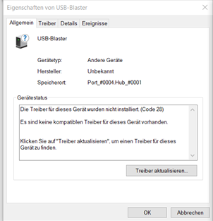

# Quartus auf dem DE0 Board

Installationsanweisungen:

1. Stecken Sie das USB Kabel in Ihren Computer und das DE0 Board.
2. Öffnen Sie das Menü „Geräte und Drucker anzeigen“ in der Systemsteuerung unter dem Punkt „Hardware und Sound“
3. Drücken Sie mit der rechten Maustaste auf „USB-Blaster“ unter „Nicht Angegeben“ und wählen Sie „Eigenschaften“ aus.

4. Wählen Sie die „Hardware“ Registrierkarte aus und drücken Sie erneut auf „Eigenschaften“

5. Drücken Sie auf „Einstellungen ändern“

6. Drücken Sie „Treiber aktualiSieren…“

7. „Auf meinem Computer nach Treibern suchen“ drücken
8. Finden Sie den Installationsort von Quartus II und gehen Sie dort ins Verzeichnis „\quartus\drivers\“
    1. Gehen Sie nicht tiefer ins Verzeichnis als der „driver“ Ordner
9. Drücken Sie „OK“ wenn Sie das richtige Verzeichnis ausgewählt haben und drücken Sie dann „Weiter“
10. Falls ein Windows-Sicherheits-Fenster sich öffnet, setzen Sie einen Haken bei „Software von „Delaware Altera Corporation“ immer vertrauen“ und drücken Sie auf „Installieren“

Hier nochmal das ganze in Videoform, falls Sie nicht ganz folgen konnte.

  <embed
    src="https://www.youtube.com/embed/PE9Uxkb9s1w?si=C6sB8agcv-52HQWJ"
    wmode="transparent"
    type="video/mp4"
    width="100%" height="100%"
    allow="autoplay; encrypted-media; picture-in-picture"
    allowfullscreen
    title="USB Blaster"
  >

