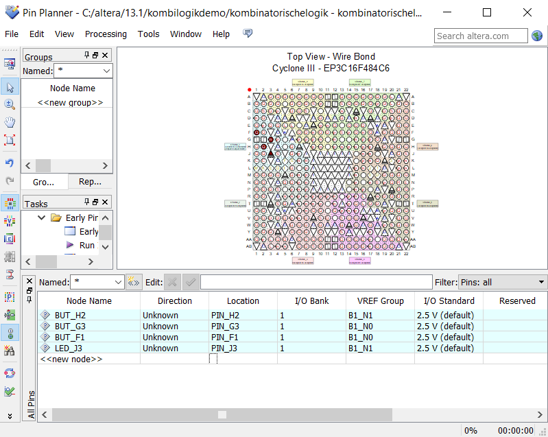

Damit die Eingänge und Ausgänge funktionieren, müssen sie im Pin-Planner richtig definiert werden.
Bei node name vergibt man einen Namen für das Signal, dieser ist frei wählbar, muss aber im VHDL Code gleich wie im Pin-Planner sein. Bei Location wählt man den Pin aus, der verwendet werden soll.
Diese Pins und die Dinge, die daran angeschlossen sind, kann man im Benutzerhandbuch des DE0-Boards nachlesen.