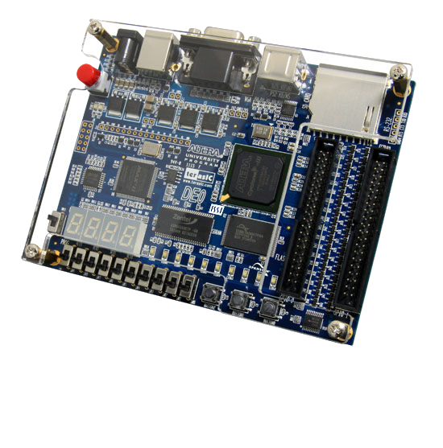

# Das DE0-Board

Das Altera DE0-Board basiert auf einem Cyclone 3 FPGA-Baustein. Dieser ist in Zusammenarbeit mit Intel entstanden. FPGAs sind Bausteine, die man mit digitaler Logik programmieren kann. Für diese Programmierung lassen sich verschiedenste IDEs verwenden, wir benutzen Herstellereigene Altera Quartus 2.

### Anschlüsse des Bords:

- USB
- VGA
- PS2
- SD- Kartenleser
- 2 Flachbandkabelanschlüsse

### Inputs:

- 10 Schalter
- 3 Taster

### Outputs:

- 4 7-Segment Anzeigen,
- 10 grüne LEDs