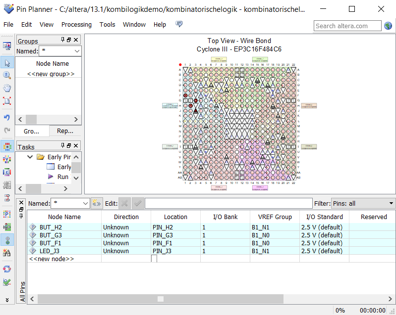

# Code mit Erklärung
Dieser Beispielcode behandelt eine einfache logische Schaltung, welche aus einem UND und einem ODER Gatter besteht. Die Schaltung hat 3 Buttons als Inputs sowie eine LED als Output.

Zu Beginn des Programms müssen die benötigten libraries installiert werden.
```vhdl
library IEEE;
```

<br />
Mithilfe von „use“ wird bestimmt, welche Teile der library genutzt werden sollen.

```vhdl
use IEEE.STD_LOGIC_1164.ALL;
```

<br />
Im „entity“ Teil des Programms werden die Aus- und Eingänge der Schaltung konfiguriert. Hier ist zu beachten, dass der name nach „entity“ gleich sein muss als der, der im Project Navigator steht (siehe Video). Außerdem müssen die Signale auch im Pin Planner korrekt eingestellt werden.
Hier wird auch eine Variable für den temporären Stand erstellt.
In diesem Beispiel sind die Eingänge BUT_G3, BUT_F1 und BUT_H2. Der Ausgang ist die LED_J3.


```vhdl
entity kombinatorischelogik is
	Port ( BUT_H2 : in STD_LOGIC;
			 BUT_G3 : in STD_LOGIC;
			 BUT_F1 : in STD_LOGIC;
			 LED_J3 : out STD_LOGIC);
	signal LED_STATUS : bit;
end kombinatorischelogik;
```

<br />
In „architekture Behaviorial“ wird die Logik der Schaltung definiert. In diesem Programm gibt es zwei Prozesse. 

```vhdl
architecture Behaviorial of kombinatorischelogik is
```

<br />
Der erste Prozess stellt das ODER Gatter dar. Wenn sowohl der BUT_F1 als auch der BUT_G3 gedrückt ist, dann wird die Variable auf 1 gesetzt. (Hinweis: bei den Buttons muss auf 0 abgefragt werden, da sie im gedrückten Zustand 0, im ungedrückten Zustand 1 zurückgeben)
Der zweite Prozess stellt das UND Gatter dar. Wenn der BUT_H2 oder der Ausgang des ODER Gatters 1 ist, dann wird die LED eingeschaltet, sonst bleibt sie ausgeschaltet.

```vhdl
begin
	process (BUT_F1, BUT_G3)
	begin
		
		if (BUT_F1 = '0' or BUT_G3 = '0') then
			LED_STATUS <= '1';
		else
			LED_STATUS <= '0';
		end if;
	end process;
	
	process (BUT_H2, LED_STATUS)
	begin
		if (BUT_H2 = '0' and LED_STATUS = '1') then
			LED_J3 <= '1';
		else
			LED_J3 <= '0';
		end if;
	end process;
		
end Behaviorial;
```
Bei den Buttons ist darauf zu achten, dass sie beim drücken **0** zurückgeben, ungedrückt **1**.


### Hier Noch der Pin Planner


