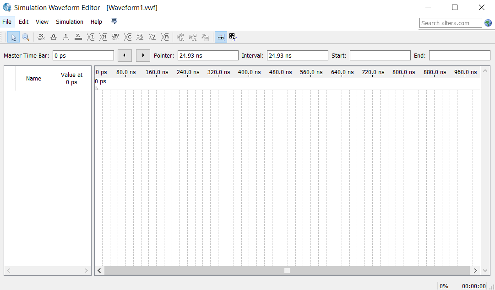

# Simulation in Quartus

Simulation in Quartus:

In der Entwicklungsphase einer Schaltung ist es oftmals von Vorteil, wenn man die Schaltung ohne die physische Hardware testen und debuggen kann.

In solchen Situationen ist die Simulation einer Schaltung sehr hilfreich, da sie schneller ausführbar ist als wie auf der echten Hardware. Für solche Simulationen gibt es viele verschiedene Programme, in diesem Tutorial wird der ModelSim Simulator von Altera behandelt, da dieser gut mit der Quartus Entwicklungsumgebung zusammen funktioniert.

Der ModelSim Simulator muss zusätzlich zu Quartus installiert werden, sonst funktioniert die Simulation nicht. Die Simulation kann dann aber direkt in Quartus ausgeführt werden.

Die Schaltung wird dann mittels dem Waveform-Editor simuliert.

Am Beginn muss eine Waveform-Datei angelegt werden.

Diese kann man unter „New File University Programm VWF“ anlegen.

Nach erstellen der Datei erscheint dieses Fenster:

Mittels eines Rechtsklick auf den linken Kasten wird ein Menü aufgerufen, darin kann dann mittels „Insert node or bus“ ein Signal eingefügt werden.

Hier den Namen des Signals und den Typ (Input oder Output) einstellen.

Über diese Methode alle Signale einfügen, die für die Simulation benötigt werden.

In der oberen Symbolleiste gibt es zwei Symbole für 0 und 1. Um die Signale auf den jeweiligen Status zu setzen, muss man zuerst den zu setzenden Signalbereich auswählen. Danach einfach oben auf das jeweilige Symbol klicken und der Status wird gesetzt.

Um die Simulation auszuführen, muss oben in der Symbolleiste auf „Run Functional Simulation“ geklickt werden. Die Ergebnisse der Simulation kann man an dem Status der Ausgänge ablesen.

So funktioniert die Simulation in Quartus.