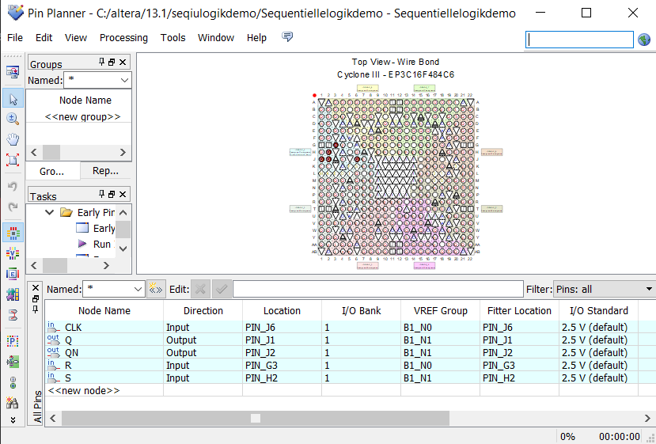

# Code mit Erklärung


Library IEEE wird importiert
```vhdl
library IEEE;
use IEEE.STD_LOGIC_1164.ALL;
use IEEE.STD_LOGIC_ARITH.ALL;
use IEEE.STD_LOGIC_UNSIGNED.ALL;

entity Sequentiellelogikdemo is
    Port ( R : in STD_LOGIC;
           S : in STD_LOGIC;
           CLK : in STD_LOGIC;
           Q : out STD_LOGIC;
           QN : out STD_LOGIC);
end Sequentiellelogikdemo;

architecture Behavioral of Sequentiellelogikdemo is
    signal Q_temp, QN_temp : STD_LOGIC;
begin
    process (CLK)
    begin
        if rising_edge(CLK) then
            if R = '1' and S = '0' then
                Q_temp <= '0';
                QN_temp <= '1';
            elsif R = '0' and S = '1' then
                Q_temp <= '1';
                QN_temp <= '0';
            else
                Q_temp <= Q_temp;
                QN_temp <= QN_temp;
            end if;
        end if;
    end process;

    Q <= Q_temp;
    QN <= QN_temp;
end Behavioral;
```
Bei den Buttons ist darauf zu achten, dass sie beim drücken **0** zurückgeben, ungedrückt **1**.


### Hier Noch der Pin Planner

